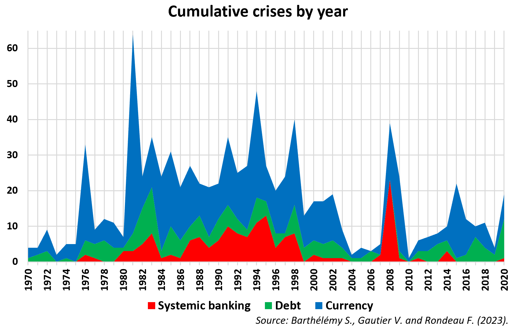
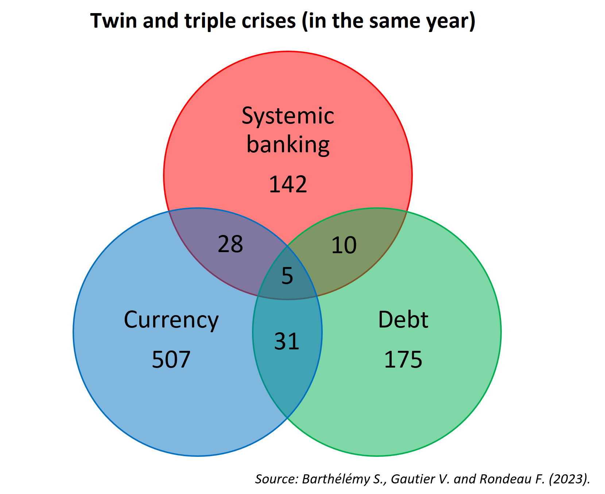
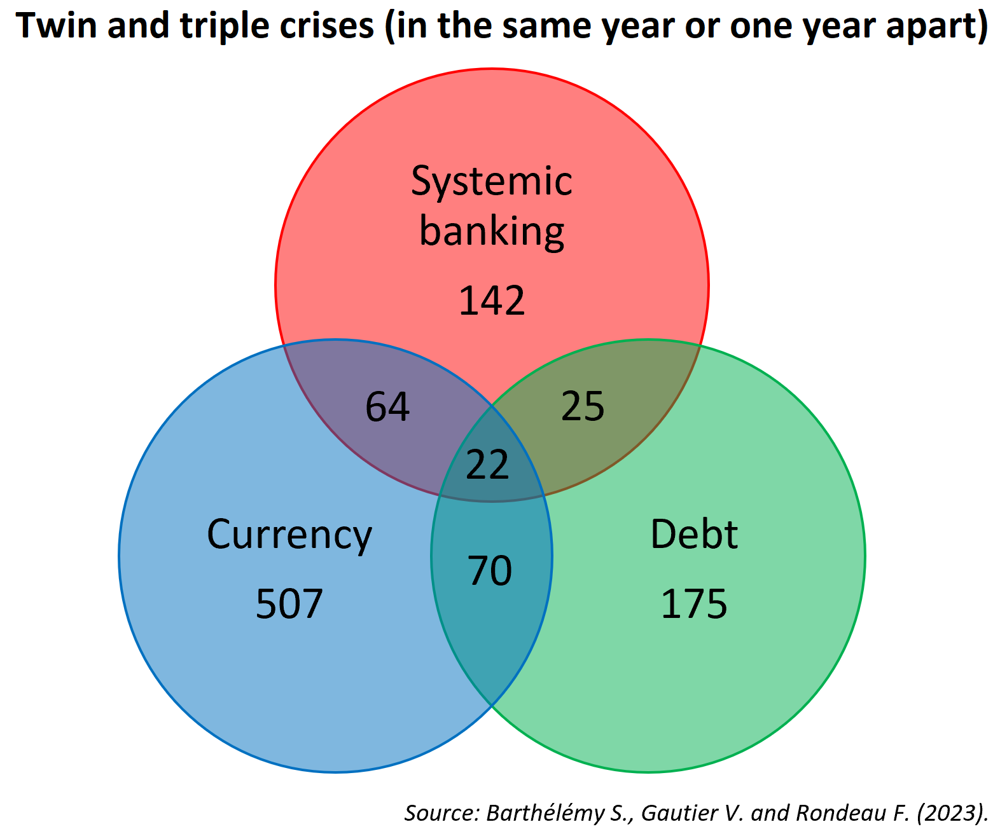

# Motivations

The objective of this directory is to gather the dating of crises (banking, currency and sovereign debt) existing in the literature in order to facilitate comparison and to propose the most up-to-date dating (January 2023) by making available the python programs allowing to build it.
This dating is part of the study of financial crises and continues the work started in my paper ***"Early Warning System for Currency Crises Using Long Short-Term Memory and Gated Recurrent Unit Neural Networks"*** available in the *doc* directory (Barthelely_Gautier_Rondeau_2022).

# Path description
| *Path* | Description |
|---|---|

- | *data/financial_crises/clean_databases* | Dates of the three types of crises in Excel format (banking, foreign exchange and debt) from the literature in an identical format (panel). Contains a file specific to each dating and a global file allowing comparisons between the different papers. |  
- | *data/financial_crises/raw_databases*   | Dates of the three types of crises in Excel format (banking, foreign exchange and debt) from the literature without standardising the files (file as exported).  | 
- | *doc*    | Paper related to crisis dating in previous directories. | 
- | *models* | Program to build the dating (one program for each type of crisis and an associated Excel file of results). | 
- | *utils*  | Support functions for the three python crisis dating programs. | 
- | *graphs* | Graphic analysis of the proposed dating. | 

# Crisis criteria
Definition of the crises retained in order to construct the dating.
 
## Systemic banking crises
*Baron M., Verner E. and Xiong W. (2020)*.
 
## Currency crises
*Frankel J. and Rose A. (1996)* with *Laeven L. and Valencia F. (2020)* thresholds. 
 
## Debt crises
*Nguyen T. C., Castro V. and Wood J. (2022)*.

# Some results

  

 

  

 

  

